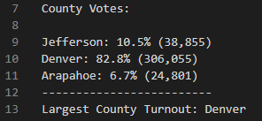
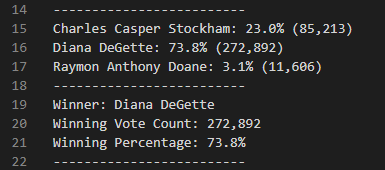

# Election_Analysis
## Overview of Election Audit
### Purpose
The purpose of this election audit analysis is to ascertain specific information requested regarding county voter turnout and candidate results of a recent Colorado congressional election, to include the following:

- total number of votes cast
- list of candidates who recieved votes
- total number and percentage of votes each candidate recieved
- the winner of the election based on popular vote
- voter turnout for each county
- percentage of votes from each county out of the total count
- county with the highest voter turnout

## Election-Audit Results
The analysis of the election shows:
* There were 369,711 total votes cast in the election.
* For the total number of votes and percentage of total votes by county:
     - Jefferson County had 38,855 votes, at 10.5% of the total votes.
     - Denver County had 306,055 votes, at 82.8%.
     - Arapahoe County had 24,801 votes, at 6.7%.
* Dever County had the largest voter turnout.

* For the candidates who recieved votes, the number and percentage of total votes each recieved were as follows:
     - Charles Casper Stockham won 85,213 votes, 23% of the total votes.
     - Diana DeGette won 272,892 votes, at 73.8%.
     - Raymon Anthony Doane won 11,606 votes, 3.1%.
* The winner of the election by popular vote, with 272,892 votes at 73.8% of the total vote, was Diana DeGette.

## Election-Audit Summary
The script used in performing this analysis could be used for any election, with some modifications. For example:
- The script could include a calculation to show how many votes each candidate won from each county.
- It could also be modified to identify who were the winners of the popular vote for each county.
